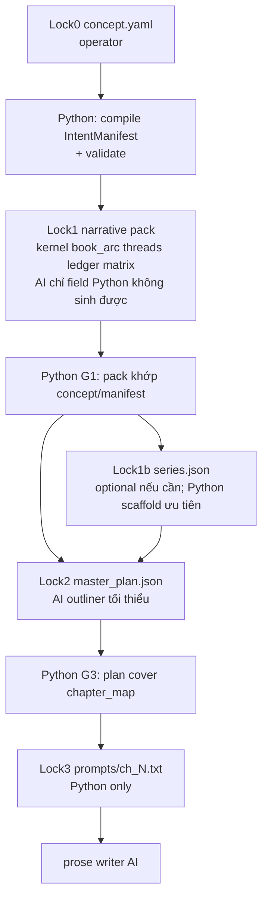
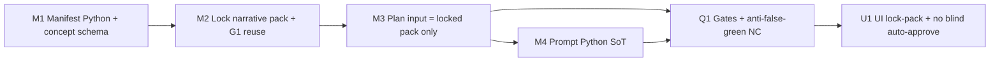

# Plan: Chuỗi khóa một chiều (máy + QC + UI) — bản chỉnh

## Kết luận về độ chắc

Nguyên tắc cũ **đúng** (một chiều, mỗi tầng chỉ đọc nguồn khóa liền trước). Điểm yếu của bản plan trước: **vội hạ narrative/bible thành “log bỏ”** — lãng phí artifact V3 đã có và có thể khóa tầng sau nếu qua gate máy.

Chỉnh lại cho chắc:

1. **Khóa = một pack đã duyệt**, không bắt buộc đúng 1 file. Tầng 1 sinh 5 file narrative → nếu Python chứng minh chúng khớp concept thì **5 file đó là một lock-pack**, tầng plan chỉ đọc pack đó (+ digest).
2. **Python-first, AI-last.** Mọi thứ compile/chiếu/merge/validate được bằng Python thì **không gọi model** (tiết kiệm token + hết paraphrase tầm bậy).
3. **Không xóa file V3.** Giữ và tận dụng; chỉ cấm chúng điều khiển nội dung khi **chưa khóa** hoặc **lệch concept**.
4. **Sai thì dừng tại tầng đó.** Không auto-approve để chạy tiếp.

---

## Quy tắc cứng (cập nhật)

| Quy tắc | Ý nghĩa |
|---------|---------|
| Một chiều | Tầng sau không ghi đè tầng trước đã khóa |
| Chỉ đọc pack khóa liền trước | Plan không đọc concept raw + bible draft + ledger chưa duyệt cùng lúc |
| Pack đa file OK | Narrative 5 file = 1 authority nếu cùng `lock_digest` / `approved` |
| Python-first | Compile manifest, chapter_map extract, merge constraints, render prompt, reveal ladder, registry scaffold = Python |
| AI-last | Chỉ outliner (beats sáng tạo) + writer (+ develop chỉ field thiếu sau Python) |
| File chưa khóa = không quyền | Draft narrative/bible/payload/QC = log cho đến khi gate pass |
| Token | Cấm AI làm việc Python làm được; cấm dump full-book vào mọi prompt |

Baseline: [`restore/last-working-factory`](d:\tieuthuyet\tieuthuyet) @ `0f809a3`. Tham chiếu schema/hành vi V3 từ backup khi hữu ích — **không** bật lại canary/story_contract/integrity repair stack.

---

## Việc 1 — Sửa máy

### 1.1 Lock0 → IntentManifest (Python, 0 AI)

Module [`factory/engine/lib/intent_manifest.py`](factory/engine/lib/intent_manifest.py):

- Compile từ `concept.yaml` (+ `direction` language/chapters): `pov`, `cast`, `chapter_count`, `chapter_map[1..N]`, `must_include_by_chapter`, `must_avoid`, `ending_book1`, `genre_profile`, `reveal_ladder`, `concept_digest`.
- Siết concept schema đủ parse cứng (chapter_map structured). Thiếu = fail, **không** nhờ LLM đoán.
- Output: `books/{book}/intent_manifest.json`. Operator `approve-intent` pin digest.

### 1.2 Tận dụng narrative pack V3 (không vứt)

Giữ [`narrative_developer.py`](factory/engine/lib/narrative_developer.py) + 5 file:

`kernel.json`, `book_arc.json`, `threads.json`, `mystery_ledger.json`, `knowledge_matrix.json` (+ meta/gates nếu có).

Cách dùng đúng:

1. **Trước AI:** Python điền mọi field suy ra được từ concept/manifest (cast list, chapter_count sync, skeleton plant/payoff từ chapter_map nếu map đủ giàu).
2. **AI chỉ pass còn lỗ trống** thật sự (không chạy 5 pass mù mọi sách).
3. **Sau AI:** Python G1 — pack phải entail concept/manifest (true_case ↔ true_plot, chapter beats ↔ map, cast ⊆ concept, không dời chamber ch8→ch10 im lặng). Fail = không approve.
4. Khi `narrative_status=approved` + digests: pack trở thành **Lock1**. Tầng sau đọc Lock1 (hoặc manifest nếu narrative tắt), không đọc draft.

[`narrative_compiler.py`](factory/engine/lib/narrative_compiler.py): giữ nhưng **chỉ Python merge có kiểm chứng** vào plan/prompt từ Lock1 đã duyệt — cấm bơm clue ID để QC tự xanh; cấm god-knowledge vào `iris_knows`; `must_not_know_before` prose phải parse được hoặc hard-fail (không silent drop).

### 1.3 Bible / registry

- [`bible_architect.py`](factory/engine/lib/bible_architect.py): không bắt buộc trên critical path. Ưu tiên **Python scaffold** `series.json` / registry từ concept+Lock1 (tên, world_rules theo reveal_ladder). AI architect chỉ khi thiếu field không suy ra được; rồi gate máy vs Lock0/1.
- [`canon_registry.py`](factory/engine/lib/canon_registry.py): scaffold Python từ concept/manifest; gate tên/spice giữ nguyên.

### 1.4 Lock2 Plan — AI tối thiểu, input = pack khóa

[`master_plan.py`](factory/engine/lib/master_plan.py) `build_outliner_payload`:

- Đọc **chỉ** Lock liền trước: `intent_manifest` + (nếu approved) narrative Lock1 slice theo act + locked names.
- Không nhét concept raw 4k + bible draft + ledger chưa khóa.
- Outliner AI sinh beats; Python post-merge constraints từ Lock1 **có chứng minh**, không overwrite ngầm làm lệch map.

`approve_plan` = G3 Python cover `chapter_map` + structural QC + pin digests Lock0/1.

### 1.5 Lock3 Prompt — Python only

[`prompt_builder.py`](factory/engine/lib/prompt_builder.py) + [`run_factory.build_writer_payload`](factory/engine/run_factory.py):

- `prompt[n] = f(plan[n], manifest[n], Lock1_slice[n])` — toàn Python.
- must_include theo chương; world rules theo reveal_ladder; POV knowledge only.
- Disk `prompts/ch_NNN.txt` + content digest = SoT lúc write. Cấm rebuild live lệch digest.

---

## Việc 2 — QC theo (Python, cực chuẩn)

### 2.1 Gate từng tầng

| Gate | Khi | Python chứng minh |
|------|-----|-------------------|
| G0 | approve-intent | manifest đủ N, map/POV/cast/ending |
| G1 | approve-narrative (nếu chạy) | pack khớp concept/manifest; không dời beat khóa |
| G1b | approve-bible (nếu chạy) | bible ⊆ Lock0/1; không spoil ladder |
| G3 | approve-plan | plan[n] covers map[n]; no placeholders; ending đúng ch |
| G4 | render / pre-write | prompt digest = projection; không dump full-book |

### 2.2 NC-01..09

- Chỉ chạy khi Lock1 narrative **đã khóa**; so plan vs **ledger đã duyệt** (phụ), không thay G3 vs concept/map.
- Cấm `merge` tự gắn ID rồi NC pass giả — NC-07 phải đòi beat prose, không chỉ token `[CLUE id]`.

### 2.3 Writer QC

- Bật neo `must_happen` từ **plan khóa** (Python).
- machine_qc / export_gate: không đưa draft bible/narrative vào quyền chặn nội dung ngoài EG hiện có.

### 2.4 Tests (0 LLM)

- I-MAP / I-COV / I-NAME / I-PROMPT / I-WRITE như trước.
- **I-TOKEN / I-PY:** compile manifest + render prompt không gọi `call_9router`; đổi bible draft không đổi prompt nếu Lock2/3 không đổi.
- **I-REUSE:** narrative pack approved + digest → outliner payload chứa pack, không chứa concept raw song song.

---

## Việc 3 — UI tương thích

[`factory_workflow.py`](factory/ui/factory_workflow.py), [`server.py`](factory/ui/server.py), [`dashboard.html`](factory/ui/static/dashboard.html):

- Primary gates: **concept → intent → (narrative pack nếu bật) → plan → prompts → write**.
- Narrative/bible **vẫn hiện** như tầng khóa (không giấu thành “log bỏ”), nhưng:
  - Prep **không** auto-approve mù.
  - Nút rõ: “Compile Python” vs “AI fill gaps”.
  - Status: draft / locked + digest.
- Approve-plan atomic với G4 (fail → `plan_approved=false`).
- Advanced: vẫn gọi đủ pass AI khi cần — sau đó bắt buộc G1.

---

## Thứ tự triển khai

Không generation sách / full LLM suite trong giai này — chỉ zone tests máy.

---

## Ngoài phạm vi

- Xóa code narrative/architect/compiler.
- Bật lại V3 canary / story_contract / integrity repair như authority.
- Sửa clean worktree `D:\tieuthuyet-restore-clean`.
