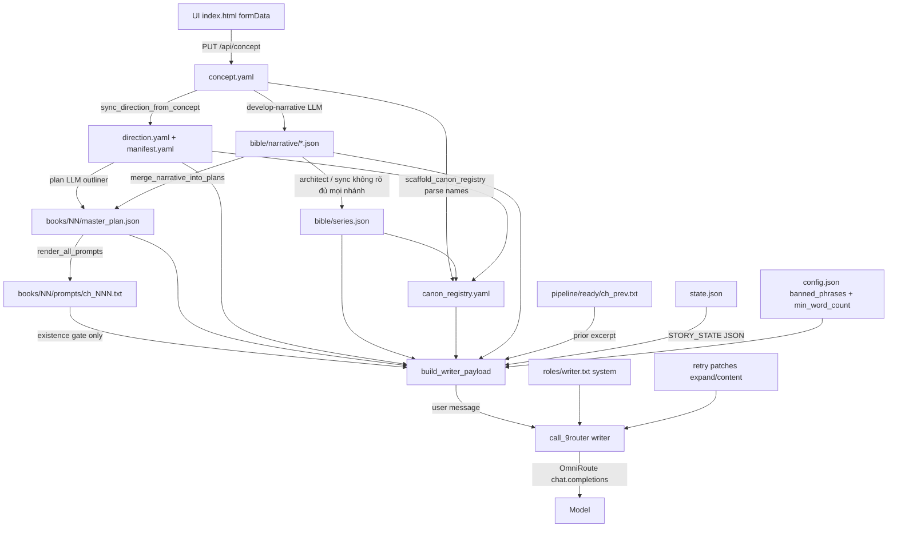

# PROMPT FLOW — Concept → Writer model

> Audit READ-ONLY (luồng prompt). Mô tả cái đang có.  
> Workspace path: `factory/workspaces/<id>/`.  
> Chỗ không chắc ghi **không rõ**.

> **Cập nhật vận hành 2026-07-19 ~10:35 UTC+7:** cấu trúc chương / export title đã khép vòng fail-loud  
> (`writer_completeness` + EG-03 mở rộng). **Không** thuộc audit prompt bên dưới — xem  
> `README.md` patch log cùng ngày và `spec_kdp_subniche_recon.md` §6.10.11.

---

## 1. Concept vào bằng đường nào

### UI

| Bước | Chi tiết | File:line |
|------|----------|-----------|
| Dashboard tab Concept | iframe `src="/index.html"` | `factory/ui/static/dashboard.html:148-150` |
| Form concept | `factory/ui/static/index.html` | fields + `formData()` `:246-260` |
| Lưu nháp | `PUT /api/concept/{ws}` body = `formData()` | `index.html:361-368` → `server.py` route `:692+` |
| Đánh dấu sẵn sàng | `PUT /api/concept/{ws}/ready` | `index.html:392+` → `server.py:447-450` |
| AI sinh narrative | `POST /api/concept/{ws}/develop` (sau save) | `server.py:457+` |

### Fields UI → `concept.yaml`

`save_concept` (`factory/ui/server.py:219-244`) ghi:

| Form field (`formData`) | Key trong `concept.yaml` |
|-------------------------|--------------------------|
| `target_language` | `target_language` |
| `title` | `title` |
| `logline` | `logline` |
| `author_directive` | `author_directive` |
| `surface_plot` | `surface_plot` |
| `true_plot` | `true_plot` |
| `ending_book1` | `ending_book1` |
| `hook_book2` | `hook_book2` |
| `must_include` (textarea → list) | `must_include` |
| `must_avoid` (textarea → list) | `must_avoid` |
| `notes` | `notes` |
| (status) | `concept_status`: `"draft"` hoặc `"ready"` |

**Không** ghi vào `concept.yaml`:

- `pen_name` → `write_pen_name` → `direction.yaml` + `manifest.yaml` (`server.py:226-229`, `workspace_metadata.py:356+`)

**File đích:** `factory/workspaces/<id>/concept.yaml`

### Ngay sau khi lưu concept

1. `_sync_workspace_language` — sync `target_language` vào direction (`server.py:104+`, `:224`)
2. `_sync_direction_manifest_from_concept` → `sync_direction_from_concept` (`server.py:110-114`, `workspace_metadata.py:216-301`)
3. `write_title_everywhere` (`server.py:253-255`)

`sync_direction_from_concept` **đẻ / cập nhật** trên `direction.yaml` (rồi mirror một phần sang `manifest.yaml`):

| Field direction | Nguồn từ concept / suy ra |
|-----------------|---------------------------|
| `blurb` | `concept.logline` |
| `book1_ending` | `concept.ending_book1` |
| `target_language` | `concept.target_language` |
| `spice_level`, `spice_default`, `spice_badge` | `infer_spice_level(concept)` regex trên directive/notes/… |
| `spice_explicit_chapters`, `spice_steamy_chapters` | template lists scaled theo `direction.total_chapters` (nếu ≥3) |
| `arc` | `scale_act_arc(total_chapters)` |
| `setting_hub`, `setting_nodes` | `infer_setting_from_concept` (nếu template / empty / force) |
| `narrative_profile`, đôi khi `goal` | `resolve_narrative_profile(ws, concept)` |

**Ghi chú:** `total_chapters` **không** bị concept save ghi đè (`workspace_metadata.py:250-251` — comment: operator set qua UI direction).

---

## 2. Luồng (concept → text model đọc)



### Bảng bước (đọc → đẻ → ghi)

| # | Bước | Hàm / chỗ | Đọc vào | Đẻ ra | Ghi xuống |
|---|------|-----------|---------|-------|-----------|
| 1 | Lưu concept | `save_concept` `server.py:219` | HTTP body | dict concept | `concept.yaml` |
| 2 | Sync meta | `sync_direction_from_concept` `workspace_metadata.py:216` | `concept.yaml`, `direction.yaml` | spice/arc/setting/blurb… | `direction.yaml`, `manifest.yaml` |
| 3 | Develop narrative | `develop_narrative` `narrative_developer.py` | concept (+ direction) | kernel, book_arc, threads, mystery_ledger, knowledge_matrix | `bible/narrative/*.json` |
| 4 | Bible series | UI action `architect` → `generate_bible_with_retry` (`factory_workflow.py:606-609`, `bible_architect.py`) | concept + narrative assets + direction (payload bên trong architect) | series bible JSON | `bible/series.json` |
| 5 | Canon registry | `scaffold_canon_registry` `canon_registry.py:241` | concept text + bible + direction | declarations | `canon_registry.yaml` |
| 6 | Plan | `master_plan` plan flow → LLM outliner | bible, direction, locked plans… | `chapter_plans[]` | `master_plan.json` |
| 7 | Merge narrative vào plan | `merge_narrative_into_plans` `narrative_compiler.py:615` | ledger + matrix + threads | `plan.narrative`, inject clue vào `must_happen` | `master_plan.json` |
| 8 | Render prompts (disk) | `render_all_prompts` `prompt_builder.py:375` | plan, direction, bible, canon, concept must_avoid, narrative | full chapter prompt string | `prompts/ch_NNN.txt` |
| 9 | Write — build payload | `build_writer_payload` `run_factory.py:315` | **rebuild** `build_chapter_prompt` (không đọc body file), + excerpt + state | user_content | (không ghi file prompt) |
| 10 | Call model | `_draft_chapter_prose` → `call_9router("writer", …)` `run_factory.py:584-590`, `call_9router.py:170` | system role + user payload (+ retry suffix) | prose | `pipeline/.../ch_NNN.txt` |

**Khi nào `render_all_prompts` chạy:** sau `plan` (`master_plan.py:541`), `fix_plans` (`:547`), UI `approve-plan` / `render-prompts` / sau fix (`factory_workflow.py:691-702`). CLI `approve-plan` (`run_factory.py` `cmd_approve_plan` ~841) chỉ gọi `approve_plan` — **không** re-render prompts.

**concept --ready / `concept_mark_ready`:** ngoài sync direction còn có thể gọi `sync_chapter_count_from_concept` nếu direction chưa có `total_chapters` (`concept_cli.py:97-108`, `book_config.py:41+`).

**Sự thật quan trọng:** lúc write, `prompts/ch_NNN.txt` chỉ được **check tồn tại** (`run_factory.py:316-318`). Nội dung gửi model là **build lại** bởi `build_chapter_prompt`, không phải `read_text` của file đó.

---

## 3. Ai đóng góp chữ vào prompt Writer

Thứ tự message tới API (`call_9router.py:192-197`):

1. **system** = `roles/writer.txt` (sau `render_role_template`)
2. **user** = `base_payload` + `expand_suffix` + `content_suffix`

### A. System (không nằm trong `prompts/ch_NNN.txt`)

| Nguồn | Viết gì | Vị trí |
|-------|---------|--------|
| `factory/engine/roles/writer.txt` | Luật writer, độ dài placeholder, narrative authority, plain text | message `system` |
| `render_role_template` `language.py:192` | Thay `<<language_label>>`, `<<min_words>>`, `<<target_words>>`, … từ `language_profile` + `config.min_word_count` | trong system trước gửi |

### B. User payload — phần assemble bởi `build_chapter_prompt` (`prompt_builder.py:219-372`)

Thứ tự `parts` trong code:

| # | Block | Nguồn chữ | Hàm |
|---|-------|-----------|------|
| 1 | Role header (audience) | `LANGUAGE_PROFILES[lang].role_header` + `direction.audience` (default cứng nếu thiếu) | `:329` |
| 2 | LOCKED CANON | `canon_registry.yaml` via `build_canon_registry`; `concept.must_avoid` + `bible.content_rules`; `bible.world_rules`; `phone_only_cast_constraints` | `render_locked_canon_block` `:120-200`, gọi `:246-252` |
| 3 | CHARACTER BIBLE | `bible/series.json` via `render_bible_block` (mystery answer có thể REDACT) | `:268-273`, `bible_schema.py:292+` |
| 4 | STORY SO FAR / ĐÃ XẢY RA | `master_plan.chapter_plans[].one_line_summary` (max N chương, default 5) | `format_prior_summaries` `:68-91`, `:292-298` |
| 5 | TECHNICAL REQUIREMENTS | Hardcoded trong `language.py` `tech_rules_block*` + `config.min_word_count` + bible lead placeholders | `build_tech_rules` `:169-174` |
| 6 | SIGNATURE DETAIL HINT | `plan.signature_detail_hint` | `:343-345` |
| 7 | [SPICE] block | `LANGUAGE_PROFILES[].spice[level]` + optional `plan.spice_note`; level từ plan/direction, capped `registry.spice_max` | `:275-290`, `:346-347` |
| 8 | NARRATIVE CONSTRAINTS | Compiler từ `mystery_ledger` + `knowledge_matrix` (+ threads) — **không** từ `master_plan.narrative` field khi build prompt | `narrative_constraints_block_for_prompt` `:348-357`, comment `:348` |
| 9 | YOUR TASK | title, `chapter_task`/`beat_summary`, opens, cliff, must_happen, must_not | `:358-370` |
| 10 | Output instruction | `LANGUAGE_PROFILES[].output_instruction` | `:371` |

### C. Append lúc gọi API (sau `build_chapter_prompt`, trong `build_writer_payload`)

| Nguồn | Viết gì | Vị trí |
|-------|---------|--------|
| Prior READY chapter | `## PRIOR CHAPTER …` + excerpt ≤2500 chars | `run_factory.py:335-337`, `write_guards.py:33-54`, `format_prior_excerpt_block` `:144-152` |
| `state.json` + `config.banned_phrases` | `## STORY_STATE` JSON wrapper | `run_factory.py:338-351` |

### D. Append retry (sau lần gọi đầu, cùng user message)

| Nguồn | Khi nào | Hàm |
|-------|---------|-----|
| Expand / full rewrite length patches | machine QC short | `_expand_short_patch`, `_length_full_rewrite_patch` `run_factory.py:407-440` |
| Markdown / POV / foreign / content patches | machine QC format/content | `_markdown_patch`, `_pov_patch`, … `:443+` |

---

## 4. Sự thật nằm ở đâu (và bao nhiêu chặng tới model)

| Thứ | File đọc lúc build / call Writer | Chặng điển hình trước model |
|-----|----------------------------------|------------------------------|
| **Tên nhân vật (LOCKED CANON)** | `canon_registry.yaml` (`characters.*.canonical`) qua `build_canon_registry` | Concept text parse **hoặc** bible → scaffold registry → (optional operator edit) → registry → prompt. Lúc build: registry thắng trong LOCKED CANON. Bible block **cũng** nhét tên từ `series.json` (có thể lệch registry nếu không sync). |
| **Tên trong bible block** | `bible/series.json` leads | Concept → develop/architect → series.json → `render_bible_block` |
| **POV** | `canon_registry.yaml` `pov_mode` else `direction.pov_mode` default `third_person_limited` (`canon_registry.py:1051`, `:683-686`) | Direction / registry → LOCKED CANON string. System role cũng nhắc third-person qua retry POV patch, không phải field POV riêng. |
| **Spice (per chapter)** | Ưu tiên `plan.spice`; fallback `direction.spice_*` lists / `spice_default`; cap `registry.spice_max` từ direction (`prompt_builder.py:275-282`, `canon_registry.py:675`) | Concept text → `infer_spice_level` → direction → (plan may set spice) → cap registry → LANGUAGE_PROFILES spice text |
| **Word target / min** | Target string trong `LANGUAGE_PROFILES` (`"1600-1900"`); min từ `factory/engine/config.json` `min_word_count` | Config + language profile → tech rules + system `<<min_words>>`. **Không** đọc từ concept. |
| **Số chương** | `direction.total_chapters` (operator UI); plan/`book.yaml` là fallback ở chỗ khác (`operator_sync.get_canonical_total_chapters`) | Không nhét trực tiếp vào mọi dòng prompt Writer; registry có `chapter_count`; plan có N chapter_plans. Concept save **không** set total. |
| **Luật thế giới** | `bible/series.json` `world_rules` → LOCKED CANON + bible block; thêm `content_rules` / `concept.must_avoid` | Concept must_avoid (direct) + bible rules (qua architect/develop) → prompt |
| **Audience** | `direction.audience` hoặc default string trong `prompt_builder.py:323` | Direction (thường không từ concept form fields liệt kê ở §1) |

---

## 5. Chỗ nào biến dạng

| Chỗ | Kiểu biến dạng | File:line |
|-----|----------------|-----------|
| `infer_spice_level` | Regex/heuristic từ concept prose → int spice | `workspace_metadata.py:133-155` |
| `infer_setting_from_concept` | Heuristic keyword → setting_hub | `:164-179` |
| `scale_act_arc` / `spice_chapter_lists` | Scale template chapter lists theo total | `:182-213` |
| `resolve_lead_names_for_registry` | Parse tên từ concept blob; bible fill gap | `canon_registry.py:213-238` |
| develop-narrative | **LLM** viết lại concept → narrative JSON | `narrative_developer.py` |
| plan / outliner | **LLM** → chapter_plans | `master_plan.py` / outliner role |
| `normalize_chapter_plan` / `coerce_text_*` | Unwrap nested, ép list/string | `plan_normalize` dùng trong builder |
| `format_prior_summaries` | Chỉ lấy `one_line_summary`; **cắt** còn max 5 chương (config `story_so_far_max_chapters`) | `prompt_builder.py:68-91` |
| `sanitize_text_for_registry` | Thay forbidden alias → canonical trong prior summaries + prior excerpt | `prompt_builder.py:84-87`, `write_guards.py:51-53` |
| `apply_lead_placeholders` | `<<female_lead>>` / `<<male_lead>>` → tên bible | `language.py:160-166` |
| Spice cap | `plan.spice > registry.spice_max` → hạ xuống max + WARN | `prompt_builder.py:280-282` |
| Mystery REDACT | Trước reveal chapter, ẩn đáp án trong bible block | `bible_schema.py:292-342` approx |
| Prior excerpt | Strip title line; **truncate** còn 2500 chars cuối | `write_guards.py:29-44` |
| `render_role_template` | Placeholder trong system role | `language.py:192-207` |
| Retry patches | Append lệnh viết lại vào user message | `run_factory.py:407+` |
| `call_9router` response | Strip `<think>…</think>` khỏi **output** model (không phải input prompt) | `call_9router.py:202-207` |
| File `prompts/ch_NNN.txt` vs payload | Disk snapshot có thể **lệch** payload live nếu registry/state/plan đổi sau lần render | `run_factory.py:315-334` rebuild |

**Không thấy** (trong đường Writer chính): dịch ngôn ngữ tự động concept→EN lúc build prompt. Language chỉ chọn profile `vi`/`en`.

---

## 6. Đường tắt (tới model Writer mà không qua `prompt_builder` assemble đầy đủ)

| Đường | Có qua `build_chapter_prompt`? | Ghi chú |
|-------|-------------------------------|---------|
| System `roles/writer.txt` | Không | Chỉ `load_role` / `call_9router` |
| `STORY_STATE` + `banned_phrases` | Không | Append trong `build_writer_payload` sau builder |
| Prior chapter excerpt | Không | Append trong `build_writer_payload` |
| Length/content/markdown/POV retry suffixes | Không | Append trong `_draft_chapter_prose` |
| `bench_writer_models.py` | **Không** (đọc file prompt sẵn) | Tool bench riêng `bench_writer_models.py:86-88` — không phải UI write |
| Scripts `fix_gate_errors` / `complete_truncated` | Có thể `system_override` + prompt khác | Không phải luồng write chương chuẩn |

**Đường chính UI write** (`chapter_write` → `write_one_chapter` → `_draft_chapter_prose`): luôn gọi `build_writer_payload` → bên trong gọi lại `build_chapter_prompt`. File `prompts/ch_NNN.txt` không phải nguồn chữ cuối cùng.

---

## Phụ lục — Cấu trúc user message (tóm tắt)

```
[role_header]
[LOCKED CANON]
[CHARACTER BIBLE]
[STORY SO FAR]
[TECHNICAL REQUIREMENTS]
[SIGNATURE DETAIL?]
[SPICE]
[NARRATIVE CONSTRAINTS?]
[YOUR TASK + opens/cliff/must_*]
[output_instruction]
---
[PRIOR CHAPTER excerpt?]          ← chỉ lúc write
---
## STORY_STATE ... json ...       ← chỉ lúc write
[+ REVISION patches?]             ← chỉ lúc retry
```

System song song: `roles/writer.txt` đã render placeholder.

---

*Generated as audit artifact. Evidence dated to codebase paths under `factory/` as cited.*
